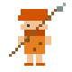

# Hi there, I'm Zai! 👋 (Yolo Dev)

<div align="center">
  <!-- Typing SVG bertema Game Retro (font Press Start 2P) -->
  
</div>

<p align="center">
  <!-- Karakter & Pet yang sudah dianimasikan dengan CSS -->
  
  &nbsp;&nbsp;&nbsp;&nbsp;&nbsp;&nbsp;
  
</p>

<h3 align="center">🤠 YOLO Developer trying turn imagination into reality</h3>

<p align="center">
  <!-- XP Gained Profile Views Counter (komarev.com/ghpvc/) berlabel custom RPG -->
  
</p>

---

### 🎮 Zai's Developer HUD
```text
+-------------------------------------------------------------+
| CLASS      : YOLO Developer             LEVEL   : 99        |
| HP         : 9999 / 9999                MP      : Coffee ☕ |
| ERA        : Holocene (Modern Tech)     STREAK  : 🔥 Active |
| ACTIVE BUFF: 🌋 Volcanic Ash (Speed +50%, Stress +10%)     |
| EQUIPPED   : 💻 Mech Keyboard, 🦖 Baby T-Rex Companion    |
+-------------------------------------------------------------+
```

---

### 🦕 Main Quest: **[PaleoBar](https://github.com/vuckuola619/paleobar)**
*Tiny Prehistoric Ecosystem Companion RPG*
* A cozy desktop idle RPG that runs in a tiny taskbar window.
* **Tech Stack**: Tauri 2 (Rust) + Vanilla HTML/CSS/JS (no framework slop!).
* **Generative Audio**: Features on-the-fly ambient music synthesized using the **Web Audio API** 🎶.
* **Game Loop**: Automated combat ticks, weather alerts (like Volcanic Ash!), procedural battles, and localized Indonesian & English education.

---

### 🌙 Space Quest: **[Bintang Hikmah (Falak)](https://github.com/vuckuola619/falak)**
*3D Solar System Space Exploration & Educational Quiz Game*

<p align="center">
  <!-- UFO melayang yang dianimasikan dengan CSS wrapper -->
  
</p>

* Flight simulation across a complete and realistic 3D Solar System (8 planets, moon orbits, asteroid belt, and Kuiper belt).
* **Tech Stack**: Three.js (WebGL) + Vanilla JS (no build steps, pure native ESM).
* **Features**:
  * Fly to glowing *Menara Ilmu* around planets to answer Islamic & astronomical quizzes.
  * Custom orbital mechanics, ship flight pitch/yaw/roll controls, camera PoV switching, and speed boosts.
  * Responsive mobile motion (gyroscope) controls and Web Audio synth.

---

### ⚡ Automation & Web Projects

#### 🤖 **[Let's Make It Easy](https://letsmakeiteasy.work)**
*AI Automation & Workflow Optimization Platform*
* A platform dedicated to making complex technology and AI automation simple and accessible.
* **Tech Stack**: Make, Zapier, n8n, ChatGPT API, Claude & Gemini integration, Docker, CI/CD.
* **Focus**: Workflow design, tool integration, and practical automation experiments.

#### 🏫 **[TK Islam Ar-Rahmah](http://tk.letsmakeiteasy.work)**
*Official School Portal & Parent Connect*
* A modern, responsive portal developed for TK Islam Ar-Rahmah.
* **Tech Stack**: React + Tailwind CSS.
* **Features**: School curriculum showcase (Hafidz Junior, Little Muslim Character) and Parent Connect features.

#### 🌳 **[TrahConnect](https://github.com/vuckuola619/AG-Trah)**
*Pohon Keluarga Digital & Arisan Indonesia*
* **Tech Stack**: TanStack Start (React 19 + Vite) + Tailwind CSS v4 + TS + Bun.
* Digital family lineage tree builder with integrated arisan group manager and halal-bihalal planner.

#### 💼 **[Raihan Com](https://github.com/vuckuola619/raihancom)**
*Platform Aset Kantor & Kartu Nama 3D Interaktif*
* **Tech Stack**: React 19 + TanStack Start SSR + Cloudflare Pages.
* Features a luxurious dark navy glassmorphism theme and a virtual business card with mouse-tilt glare effects.

---

### 🛠️ Inventory & Tech Stack (Config)
```javascript
const Zai = {
  role: "YOLO Developer",
  status: "Trying turn imagination into reality ✨",
  languages: {
    proficient: ["JavaScript", "TypeScript", "HTML5/CSS3"],
    systems: ["Rust", "Python", "GLSL Shaders"]
  },
  technologies: {
    desktopGamedev: ["Tauri 2", "Phaser 3", "Web Audio API", "Three.js (WebGL)"],
    webFullstack: ["React 19", "TanStack Start", "Astro 5", "Vite", "Tailwind CSS v4"],
    automation: ["n8n", "Make.com", "Zapier", "ChatGPT API", "Claude / Gemini APIs"],
    devOps: ["Bun", "Node.js", "Docker", "Cloudflare Pages", "Git Worktrees"]
  },
  creatureCompanion: "🦖 Baby T-Rex (Level 99)"
};
```

---

### 📈 Daily Quests (GitHub Stats)
<p align="left">
  
  &nbsp;&nbsp;
  
</p>

---

<!-- Scrolling Marquee Status Bar di bagian bawah -->
<div style="background: #1a1a1a; padding: 4px; border: 2px solid #F79F1F; border-radius: 4px;">
  <marquee behavior="scroll" direction="left" scrollamount="5" style="color: #F79F1F; font-family: monospace; font-size: 13px; font-weight: bold; margin: 0;">
    🦖 QUEST STATUS: Building PaleoBar v1.0.0 (Tauri 2 + Rust) ⛺ | CURRENT EXPEDITION: Refining WebGL Solar System Mechanics in Bintang Hikmah (Falak) 🪐 | BUFFS ACTIVE: Coffee-Power ☕ + Volcanic Ash 🌋 | "Always building, always learning..."
  </marquee>
</div>
